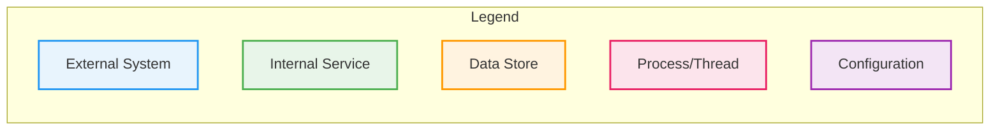
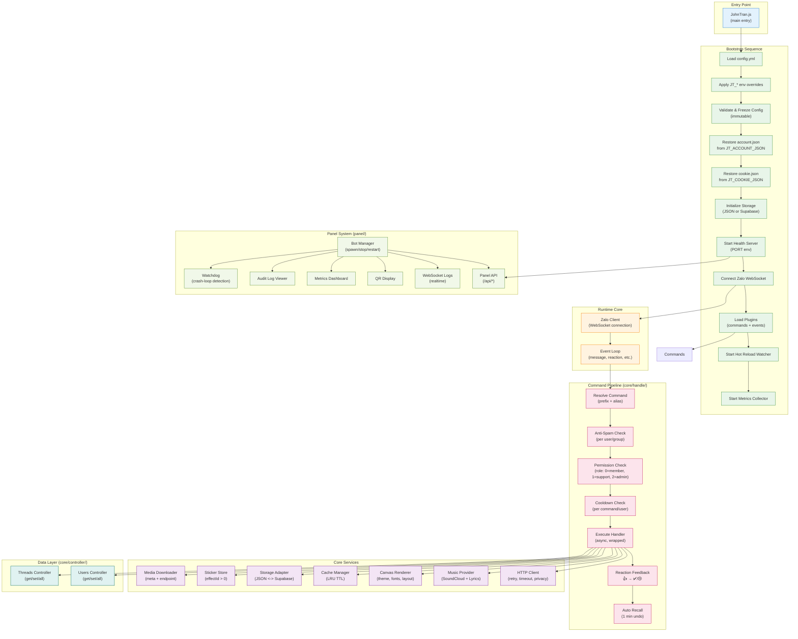
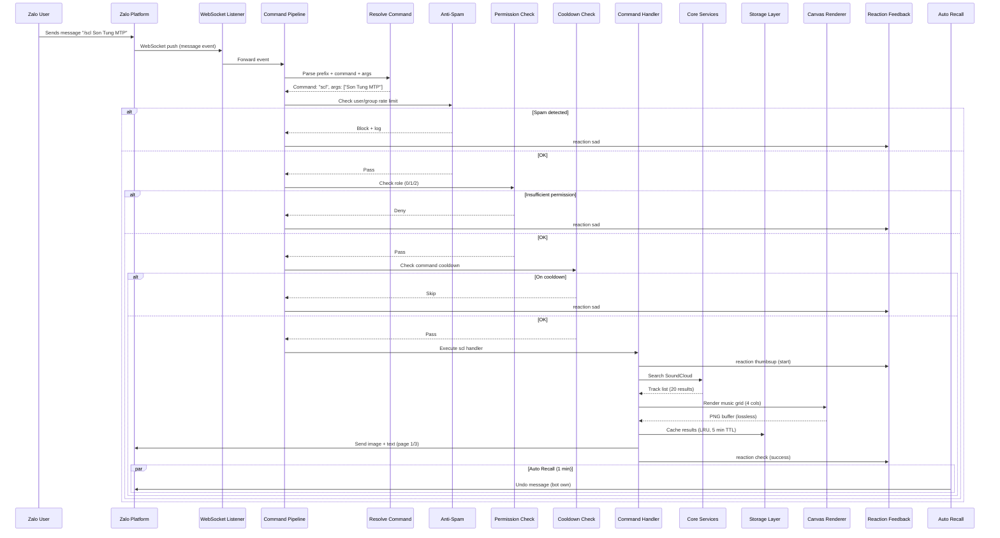
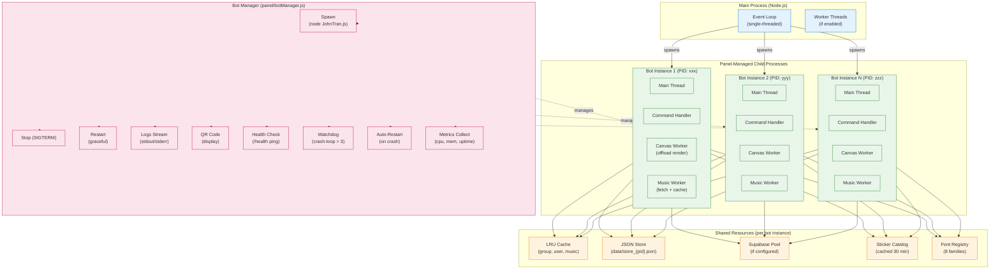

# ARCHITECTURE_COMPLETE.md

## 1. Legend

```mermaid
flowchart LR
    subgraph Legend
        A[External System]:::ext
        B[Internal Service]:::int
        C[Data Store]:::store
        D[Process/Thread]:::proc
        E[Configuration]:::cfg
    end

    classDef ext fill:#e8f4fd,stroke:#2196f3,stroke-width:2px;
    classDef int fill:#e8f5e9,stroke:#4caf50,stroke-width:2px;
    classDef store fill:#fff3e0,stroke:#ff9800,stroke-width:2px;
    classDef proc fill:#fce4ec,stroke:#e91e63,stroke-width:2px;
    classDef cfg fill:#f3e5f5,stroke:#9c27b0,stroke-width:2px;
```

## 2. Current System Overview

```mermaid
flowchart TB
    subgraph External["External Systems"]
        Zalo["Zalo Platform
(WebSocket)"]
        SoundCloud["SoundCloud API"]
        TikTokAPI["TikTok API
(tikwm + fallback)"]
        MediaDL["Media Downloader
(optional endpoint)"]
        Supabase["Supabase
(PostgreSQL)"]
        UptimeRobot["UptimeRobot
(health ping)"]
        GitHubPages["GitHub Pages
(Panel UI)"]
        Render["Render.com
(Docker Host)"]
    end

    subgraph BotRuntime["JOHNTRAN Bot Runtime (Node.js v20+)"]
        direction TB
        
        subgraph Core["core/"]
            Config["config.yml + env
(JT_*) → Immutable"]
            HTTP["HTTP Client
(timeout, retry, privacy guard)"]
            Services["Services Config
(endpoints from config)"]
            AI["AI Module
(Gemini TTS /noi)"]
            Music["Music Registry
(Track + SoundCloud + Lyrics)"]
            Message["Message Helper
(reply, card, reaction)"]
            Canvas["Canvas Renderer
(theme, vip, menu, music)"]
            Cache["LRU Cache TTL
(group, user, music)"]
            Storage["Storage Abstraction
(JSON local + Supabase)"]
            Metrics["Metrics + Audit Log
(data/audit.log)"]
            HotReload["Hot Reload
(plugin watcher)"]
            Health["Health Server
(/health endpoint)"]
            Bootstrap["Bootstrap
(account/cookie/env restore)"]
        end

        subgraph Pipeline["core/handle/"]
            Resolve["Resolve Command"]
            AntiSpam["Anti-Spam Check"]
            Permission["Permission Check
(role 0/1/2)"]
            Cooldown["Cooldown Check"]
            Execute["Execute Command"]
        end

        subgraph Loader["core/loader/"]
            CmdLoader["Command Loader"]
            EventLoader["Event Loader"]
        end

        subgraph Controller["core/controller/"]
            Users["Users Controller"]
            Threads["Threads Controller"]
        end
    end

    subgraph Panel["panel/"]
        BotManager["Bot Manager
(spawn/stop/restart/logs/QR)"]
        PanelServer["Panel API Server
(zero-dep, no Express)"]
    end

    subgraph Plugins["plugins/"]
        Commands["commands/ (23 commands)
scl, lyric, noi, stats, menu,
spam, spamsticker, card, tiktok,
infofb, getavt, autodown, events..."]
        Events["events/ (removed v3)
Pure command-based bot"]
    end

    subgraph Assets["assets/"]
        Spam["spam/*.txt
(vi, en, zh, ja, ko, th, mix)"]
        MediaData["autosend.json
girl.json
vdgirl.json"]
        BadWords["spam/badwords.txt"]
        BG["bg/theme.jpg"]
        Fonts["fonts/ (8 families)"]
    end

    subgraph Data["data/"]
        Store["store.json
(JSON atomic store)"]
        AuditLog["audit.log"]
        CacheDir["cache/"]
    end

    Zalo ---|WebSocket| BotRuntime
    SoundCloud ---|REST| Music
    TikTokAPI ---|REST| Commands
    MediaDL ---|REST| Commands
    Supabase ---|PostgreSQL| Storage
    UptimeRobot ---|HTTP /health| Health
    GitHubPages ---|HTTPS| PanelServer
    Render ---|Docker| BotRuntime

    classDef ext fill:#e8f4fd,stroke:#2196f3;
    classDef int fill:#e8f5e9,stroke:#4caf50;
    classDef store fill:#fff3e0,stroke:#ff9800;
    classDef proc fill:#fce4ec,stroke:#e91e63;
    classDef cfg fill:#f3e5f5,stroke:#9c27b0;

    class Zalo,SoundCloud,TikTokAPI,MediaDL,Supabase,UptimeRobot,GitHubPages,Render ext
    class Config,HTTP,Services,AI,Music,Message,Canvas,Cache,Storage,Metrics,HotReload,Health,Bootstrap,Resolve,AntiSpam,Permission,Cooldown,Execute,CmdLoader,EventLoader,Users,Threads,BotManager,PanelServer int
    class Store,AuditLog,CacheDir,Supabase store
    class Commands,Events proc
    class Spam,MediaData,BadWords,BG,Fonts cfg
```

## 3. Current Internal Architecture

```mermaid
flowchart TB
    subgraph Entry["Entry Point"]
        Main["JohnTran.js
(main entry)"]
    end

    subgraph Bootstrap["Bootstrap Sequence"]
        B1["Load config.yml"]
        B2["Apply JT_* env overrides"]
        B3["Validate & Freeze Config
(immutable)"]
        B4["Restore account.json
from JT_ACCOUNT_JSON"]
        B5["Restore cookie.json
from JT_COOKIE_JSON"]
        B6["Initialize Storage
(JSON or Supabase)"]
        B7["Start Health Server
(PORT env)"]
        B8["Connect Zalo WebSocket"]
        B9["Load Plugins
(commands + events)"]
        B10["Start Hot Reload Watcher"]
        B11["Start Metrics Collector"]
    end

    subgraph Runtime["Runtime Core"]
        ZaloClient["Zalo Client
(WebSocket connection)"]
        EventLoop["Event Loop
(message, reaction, etc.)"]
    end

    subgraph CommandPipeline["Command Pipeline (core/handle/)"]
        CP1["Resolve Command
(prefix + alias)"]
        CP2["Anti-Spam Check
(per user/group)"]
        CP3["Permission Check
(role: 0=member, 1=support, 2=admin)"]
        CP4["Cooldown Check
(per command/user)"]
        CP5["Execute Handler
(async, wrapped)"]
        CP6["Reaction Feedback
👍 → ✅/😢"]
        CP7["Auto Recall
(1 min undo)"]
    end

    subgraph Services["Core Services"]
        S1["HTTP Client
(retry, timeout, privacy)"]
        S2["Music Provider
(SoundCloud + Lyrics)"]
        S3["Canvas Renderer
(theme, fonts, layout)"]
        S4["Cache Manager
(LRU TTL)"]
        S5["Storage Adapter
(JSON <-> Supabase)"]
        S6["Sticker Store
(effectId > 0)"]
        S7["Media Downloader
(meta + endpoint)"]
    end

    subgraph DataLayer["Data Layer (core/controller/)"]
        DL1["Users Controller
(get/set/all)"]
        DL2["Threads Controller
(get/set/all)"]
    end

    subgraph PanelSystem["Panel System (panel/)"]
        PS1["Bot Manager
(spawn/stop/restart)"]
        PS2["Panel API
(/api/*)"]
        PS3["WebSocket Logs
(realtime)"]
        PS4["QR Display"]
        PS5["Metrics Dashboard"]
        PS6["Audit Log Viewer"]
        PS7["Watchdog
(crash-loop detection)"]
    end

    Main --> B1 --> B2 --> B3 --> B4 --> B5 --> B6 --> B7 --> B8 --> B9 --> B10 --> B11
    B8 --> ZaloClient
    ZaloClient --> EventLoop
    EventLoop --> CP1 --> CP2 --> CP3 --> CP4 --> CP5 --> CP6 --> CP7
    CP5 --> S1 & S2 & S3 & S4 & S5 & S6 & S7
    CP5 --> DL1 & DL2
    B9 --> Commands
    B7 --> PS2
    PS1 --> PS2 & PS3 & PS4 & PS5 & PS6 & PS7

    classDef entry fill:#e3f2fd,stroke:#1976d2;
    classDef boot fill:#e8f5e9,stroke:#388e3c;
    classDef rt fill:#fff3e0,stroke:#f57c00;
    classDef pipe fill:#fce4ec,stroke:#c2185b;
    classDef svc fill:#f3e5f5,stroke:#7b1fa2;
    classDef data fill:#e0f2f1,stroke:#00695c;
    classDef panel fill:#f1f8e9,stroke:#558b2f;

    class Main entry
    class B1,B2,B3,B4,B5,B6,B7,B8,B9,B10,B11 boot
    class ZaloClient,EventLoop rt
    class CP1,CP2,CP3,CP4,CP5,CP6,CP7 pipe
    class S1,S2,S3,S4,S5,S6,S7 svc
    class DL1,DL2 data
    class PS1,PS2,PS3,PS4,PS5,PS6,PS7 panel
```

## 4. Request Flow

```mermaid
sequenceDiagram
    participant User as Zalo User
    participant Zalo as Zalo Platform
    participant WS as WebSocket Listener
    participant Pipeline as Command Pipeline
    participant Resolve as Resolve Command
    participant AntiSpam as Anti-Spam
    participant Perm as Permission Check
    participant CD as Cooldown Check
    participant Handler as Command Handler
    participant Services as Core Services
    participant Storage as Storage Layer
    participant Canvas as Canvas Renderer
    participant React as Reaction Feedback
    participant Recall as Auto Recall

    User->>Zalo: Sends message "/scl Son Tung MTP"
    Zalo->>WS: WebSocket push (message event)
    WS->>Pipeline: Forward event
    
    Pipeline->>Resolve: Parse prefix + command + args
    Resolve-->>Pipeline: Command: "scl", args: ["Son Tung MTP"]
    
    Pipeline->>AntiSpam: Check user/group rate limit
    alt Spam detected
        AntiSpam-->>Pipeline: Block + log
        Pipeline->>React: reaction sad
    else OK
        AntiSpam-->>Pipeline: Pass
        Pipeline->>Perm: Check role (0/1/2)
        alt Insufficient permission
            Perm-->>Pipeline: Deny
            Pipeline->>React: reaction sad
        else OK
            Perm-->>Pipeline: Pass
            Pipeline->>CD: Check command cooldown
            alt On cooldown
                CD-->>Pipeline: Skip
                Pipeline->>React: reaction sad
            else OK
                CD-->>Pipeline: Pass
                Pipeline->>Handler: Execute scl handler
                Handler->>React: reaction thumbsup (start)
                
                Handler->>Services: Search SoundCloud
                Services-->>Handler: Track list (20 results)
                
                Handler->>Canvas: Render music grid (4 cols)
                Canvas-->>Handler: PNG buffer (lossless)
                
                Handler->>Storage: Cache results (LRU, 5 min TTL)
                Handler->>Zalo: Send image + text (page 1/3)
                
                Handler->>React: reaction check (success)
                
                par Auto Recall (1 min)
                    Recall->>Zalo: Undo message (bot own)
                end
            end
        end
    end
```

## 5. Worker Pool

```mermaid
flowchart TB
    subgraph MainProcess["Main Process (Node.js)"]
        EventLoop["Event Loop
(single-threaded)"]
        WorkerThreads["Worker Threads
(if enabled)"]
    end

    subgraph PanelWorkers["Panel-Managed Child Processes"]
        direction TB
        
        subgraph Bot1["Bot Instance 1 (PID: xxx)"]
            B1Main["Main Thread"]
            B1Handle["Command Handler"]
            B1Canvas["Canvas Worker
(offload render)"]
            B1Music["Music Worker
(fetch + cache)"]
        end

        subgraph Bot2["Bot Instance 2 (PID: yyy)"]
            B2Main["Main Thread"]
            B2Handle["Command Handler"]
            B2Canvas["Canvas Worker"]
            B2Music["Music Worker"]
        end

        subgraph BotN["Bot Instance N (PID: zzz)"]
            BNMain["Main Thread"]
            BNHandle["Command Handler"]
            BNCanvas["Canvas Worker"]
            BNMusic["Music Worker"]
        end
    end

    subgraph SharedResources["Shared Resources (per bot instance)"]
        SR1["LRU Cache
(group, user, music)"]
        SR2["JSON Store
(data/store_{pid}.json)"]
        SR3["Supabase Pool
(if configured)"]
        SR4["Sticker Catalog
(cached 30 min)"]
        SR5["Font Registry
(8 families)"]
    end

    subgraph PanelManager["Bot Manager (panel/botManager.js)"]
        PM1["Spawn
(node JohnTran.js)"]
        PM2["Stop (SIGTERM)"]
        PM3["Restart
(graceful)"]
        PM4["Logs Stream
(stdout/stderr)"]
        PM5["QR Code
(display)"]
        PM6["Health Check
(/health ping)"]
        PM7["Watchdog
(crash-loop > 3)"]
        PM8["Auto-Restart
(on crash)"]
        PM9["Metrics Collect
(cpu, mem, uptime)"]
    end

    EventLoop -->|spawns| Bot1
    EventLoop -->|spawns| Bot2
    EventLoop -->|spawns| BotN

    Bot1 --> SR1 & SR2 & SR3 & SR4 & SR5
    Bot2 --> SR1 & SR2 & SR3 & SR4 & SR5
    BotN --> SR1 & SR2 & SR3 & SR4 & SR5

    PanelManager --> PM1 & PM2 & PM3 & PM4 & PM5 & PM6 & PM7 & PM8 & PM9
    PanelManager -.->|manages| Bot1
    PanelManager -.->|manages| Bot2
    PanelManager -.->|manages| BotN

    classDef main fill:#e3f2fd,stroke:#1976d2;
    classDef bot fill:#e8f5e9,stroke:#388e3c;
    classDef shared fill:#fff3e0,stroke:#f57c00;
    classDef mgr fill:#fce4ec,stroke:#c2185b;

    class EventLoop,WorkerThreads main
    class Bot1,Bot2,BotN,B1Main,B1Handle,B1Canvas,B1Music,B2Main,B2Handle,B2Canvas,B2Music,BNMain,BNHandle,BNCanvas,BNMusic bot
    class SR1,SR2,SR3,SR4,SR5 shared
    class PM1,PM2,PM3,PM4,PM5,PM6,PM7,PM8,PM9,PanelManager mgr
```
